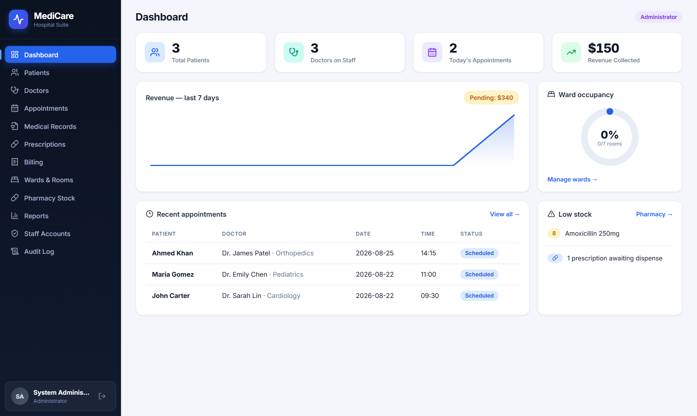
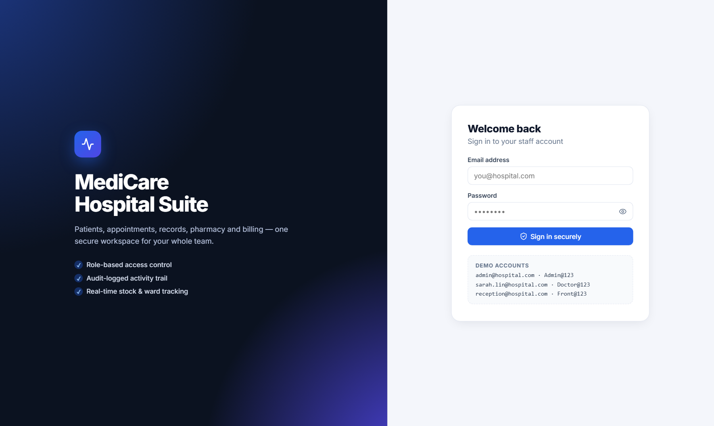
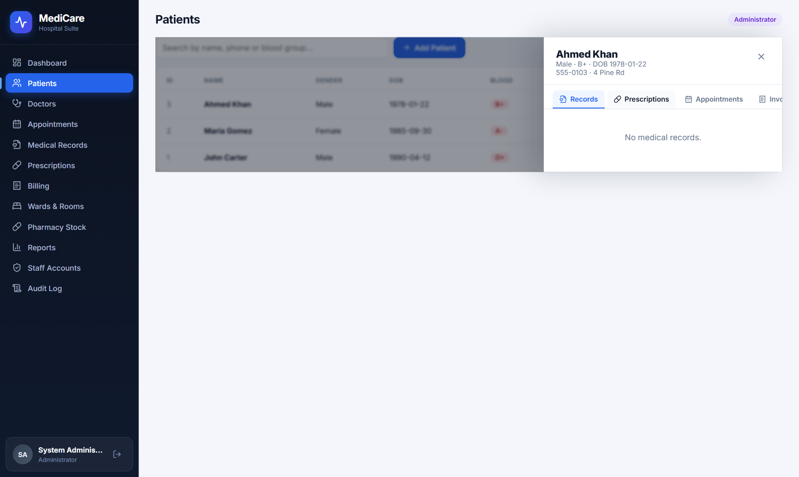
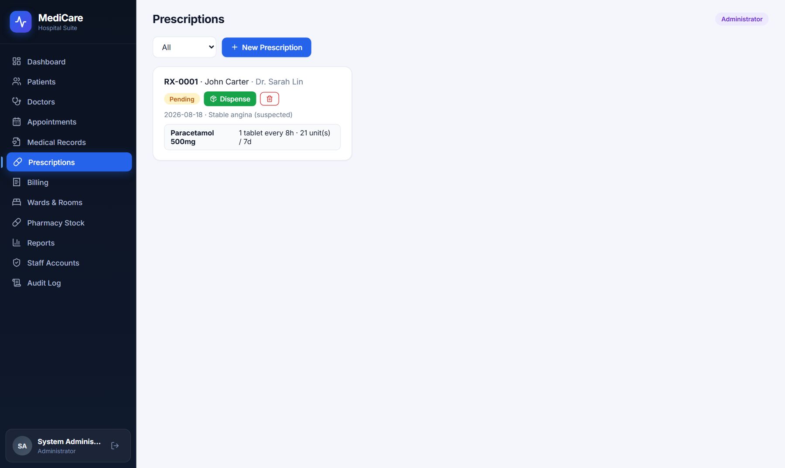
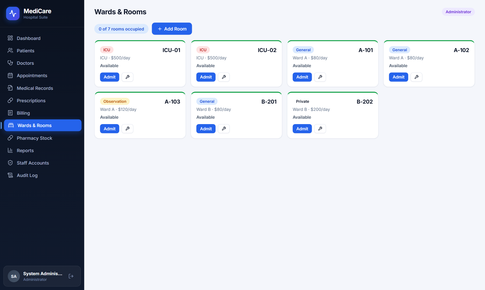
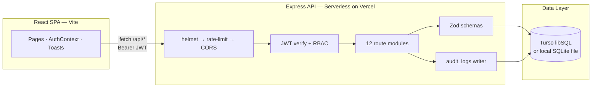
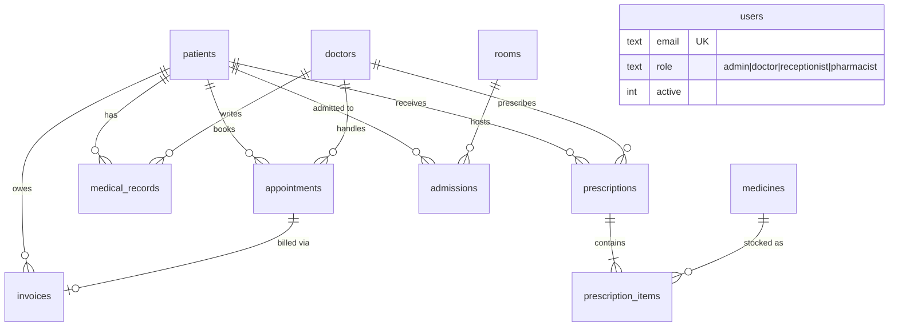

# 🏥 MediCare — Hospital Management System

> A production-grade, full-stack hospital management platform with JWT authentication, role-based access control, medical records & prescriptions, ward management with automated billing, pharmacy inventory, audit logging and real-time analytics.

**🌐 Live Demo → https://hospital-management-system-fawn-six.vercel.app**

     [](https://github.com/rigved-24/medicare-hospital-management-system/actions/workflows/ci.yml)



---

## ✨ Highlights

| | |
|---|---|
| 🔐 **Security-first** | bcrypt password hashing · JWT sessions · role-based access enforced server-side · rate limiting · Helmet headers · Zod validation on every endpoint · parameterized SQL only |
| 🧾 **Audit trail** | Every login and data mutation recorded with user, IP and payload details — viewable by admins |
| 💊 **Smart pharmacy** | Prescriptions dispense atomically: stock is validated and deducted in a single transaction, with shortage reporting |
| 🛏️ **Ward intelligence** | Admit/discharge flow auto-generates stay invoices (days × daily rate) |
| 📊 **Analytics** | Revenue trends, occupancy gauge, most-prescribed medicines, top diagnoses |
| ⚡ **Zero-native stack** | SQLite-compatible libSQL driver — runs locally on a file DB or globally on Turso, no C++ toolchain required |

## 📸 Screenshots

| | |
|---|---|
|  |  |
| *Secure split-screen login* | *Unified patient profile drawer* |
|  |  |
| *Multi-item prescription builder* | *Live ward occupancy grid* |

*[View all 11 screenshots →](docs/screenshots)*

## 🧩 Modules

| Module | Capabilities |
|---|---|
| **Dashboard** | Live KPIs, 7-day revenue chart, ward occupancy gauge, low-stock alerts |
| **Patients** | CRUD + search, unified profile drawer (records · Rx · visits · invoices) |
| **Doctors** | Staff directory with specializations & consultation fees |
| **Appointments** | Book / complete / cancel, status filters, one-click invoicing |
| **Medical Records** | Visit history with vitals (BP / temp / pulse), diagnosis, treatment plans |
| **Prescriptions** | Multi-medicine builder → pharmacist dispensing → automatic stock deduction |
| **Billing** | Invoices, paid/unpaid tracking, auto-invoice from completed visits & discharges |
| **Wards & Rooms** | Room grid by ward/type/status, admit/discharge with stay billing |
| **Pharmacy Stock** | Inventory CRUD, ±1/±10 quick adjustments, low-stock & expiry warnings |
| **Reports** | Monthly revenue, top medicines, top diagnoses, occupancy analytics |
| **Staff Accounts** | Admin-only: create users, change roles, reset passwords, disable accounts |
| **Audit Log** | Filterable trail of every security-relevant event |

## 🛠 Tech Stack

| Layer | Technology | Version |
|---|---|---|
| Frontend | React + Vite | 18.3 / 5.4 |
| Routing | react-router-dom | 6.30 |
| Icons | lucide-react | 0.525 |
| Styling | Hand-crafted CSS design system (GPU-accelerated animations) | — |
| Backend | Node.js + Express | ≥20 / 4.21 |
| Database | libSQL (SQLite-compatible) — Turso cloud or local file | client 0.14 |
| Auth | jsonwebtoken + bcryptjs | 9.0 / 3.0 |
| Validation | Zod | 3.24 |
| Hardening | helmet + express-rate-limit | 8.1 / 7.5 |
| Deployment | Vercel (static SPA + serverless functions) | — |

## 🏗 Architecture



### Entity Relationships



## 🔐 Security Model

Role-based access is **enforced server-side** on every route — the UI simply mirrors it.

| Capability | Admin | Doctor | Receptionist | Pharmacist |
|---|:-:|:-:|:-:|:-:|
| View data | ✓ | ✓ | ✓ | ✓ |
| Patients / Appointments write | ✓ | ✓ | ✓ | — |
| Medical records write | ✓ | ✓ | — | — |
| Prescriptions create | ✓ | ✓ | — | — |
| Dispense (stock deduction) | ✓ | ✓ | — | ✓ |
| Billing write | ✓ | — | ✓ | — |
| Pharmacy stock write | ✓ | — | — | ✓ |
| Delete any record | ✓ | — | — | — |
| Staff accounts · Audit log | ✓ | — | — | — |

Additional hardening: login rate-limiting (25 attempts / 15 min), generic authentication errors (no user enumeration), last-admin & self-delete protection, 256 KB body limit, secret auto-generation with env override.

## 🚀 Run Locally

```bash
git clone https://github.com/rigved-24/medicare-hospital-management-system.git
cd medicare-hospital-management-system

# Terminal 1 — API on http://localhost:4000
cd server && npm install && npm run dev

# Terminal 2 — UI on http://localhost:3000
cd ../client && npm install && npm run dev
```

Open **http://localhost:3000** — the SQLite database is created and seeded automatically on first run.

**Demo accounts**

| Email | Password | Role |
|---|---|---|
| admin@hospital.com | `Admin@123` | Administrator |
| sarah.lin@hospital.com | `Doctor@123` | Doctor |
| reception@hospital.com | `Front@123` | Receptionist |
| pharmacy@hospital.com | `Pharma@123` | Pharmacist |

> ⚠️ Change these before any real deployment (Staff Accounts → reset icon).

## ☁️ Deploy to Vercel + Turso

1. `turso db create medicare` → grab the URL and a token (`turso db tokens create medicare`)
2. Import the repo at [vercel.com/new](https://vercel.com/new)
3. Set environment variables: `TURSO_DATABASE_URL`, `TURSO_AUTH_TOKEN`, `JWT_SECRET`
4. Ship it — schema and demo data self-initialize on the first request

Full walkthrough: [DEPLOYMENT.md](DEPLOYMENT.md)

## 📡 API Reference

All routes are prefixed with `/api` and require a `Authorization: Bearer <token>` header (except health + login).

| Method | Endpoint | Description | Roles |
|---|---|---|---|
| POST | `/auth/login` | Sign in → `{ token, user }` | public |
| GET | `/stats` | Dashboard aggregates | any |
| GET/POST | `/patients` | List (`?q=`) / create | see RBAC |
| GET | `/patients/:id/detail` | Full patient dossier | any |
| PUT/DELETE | `/patients/:id` | Update / delete | write / admin |
| CRUD | `/doctors` | Staff directory | admin, receptionist |
| GET/POST/PUT | `/appointments` | Booking + status workflow | admin, doctor, receptionist |
| PATCH | `/invoices/:id/status` | Mark paid/unpaid | admin, receptionist |
| GET/POST | `/records` | Medical records (`?patient_id=`) | write: doctor, admin |
| POST | `/prescriptions` | Create multi-item Rx | doctor, admin |
| PATCH | `/prescriptions/:id/dispense` | Atomic stock deduction | pharmacist, doctor, admin |
| GET | `/wards/rooms` | Rooms + live occupancy | any |
| POST | `/wards/admit` · `/wards/discharge/:id` | Admission cycle + auto-billing | admin, doctor, receptionist |
| PATCH | `/inventory/:id/stock` | Stock adjustment `{ delta }` | pharmacist, admin |
| GET | `/reports` | Analytics bundle | admin, doctor |
| GET | `/audit` · `/users` | Audit trail / staff mgmt | admin |

## 📁 Project Structure

```
├── api/index.js              # Vercel serverless entry
├── server/
│   └── src/
│       ├── index.js          # Express app, middleware chain, /api/stats
│       ├── db.js             # libSQL client, schema init, seeding
│       ├── middleware/auth.js # JWT, RBAC, audit logger
│       └── routes/           # 12 domain modules
├── client/
│   └── src/
│       ├── components/       # Layout, Modal, Toasts, PatientDrawer
│       ├── context/          # AuthContext
│       └── pages/            # 13 pages
├── docs/screenshots/         # App screenshots
└── vercel.json               # SPA + API rewrites
```

## 🗺 Roadmap

- [ ] Lab test orders & results module
- [ ] PDF invoice export
- [ ] Appointment reminders (email/SMS)
- [ ] Refresh-token rotation
- [ ] E2E tests with Playwright

---

Built with ❤️ by [Rigved](https://github.com/rigved-24) — feedback and stars appreciated!
